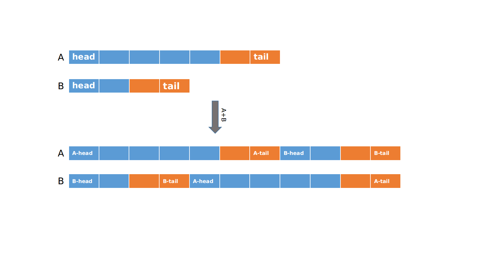

# [Intersection of Two Linked Lists][title]

## Description

Write a program to find the node at which the intersection of two singly linked lists begins.

For example, the following two linked lists:

[](https://assets.leetcode.com/uploads/2018/12/13/160_statement.png)

begin to intersect at node c1.

**Example 1:**

[](https://assets.leetcode.com/uploads/2018/12/13/160_example_1.png)

```
Input: intersectVal = 8, listA = [4,1,8,4,5], listB = [5,0,1,8,4,5], skipA = 2, skipB = 3
Output: Reference of the node with value = 8
Input Explanation: The intersected node 's value is 8 (note that this must not be 0 if the two lists intersect). From the head of A, it reads as [4,1,8,4,5]. From the head of B, it reads as [5,0,1,8,4,5]. There are 2 nodes before the intersected node in A; There are 3 nodes before the intersected node in B.
```

**Example 2:**

[](https://assets.leetcode.com/uploads/2018/12/13/160_example_2.png)

```
Input: intersectVal = 2, listA = [0,9,1,2,4], listB = [3,2,4], skipA = 3, skipB = 1
Output: Reference of the node with value = 2
Input Explanation:  The intersected node's value is 2 (note that this must not be 0 if the two lists intersect). From the head of A, it reads as [0,9,1,2,4]. From the head of B, it reads as [3,2,4]. There are 3 nodes before the intersected node in A; There are 1 node before the intersected node in B.
```

**Example 3:**

[](https://assets.leetcode.com/uploads/2018/12/13/160_example_3.png)

```
Input: intersectVal = 0, listA = [2,6,4], listB = [1,5], skipA = 3, skipB = 2
Output: null
Input Explanation: From the head of A, it reads as [2,6,4]. From the head of B, it reads as [1,5]. Since the two lists do not intersect, intersectVal must be 0, while skipA and skipB can be arbitrary values.
Explanation: The two lists do not intersect, so return null.
```

**Notes:**

* If the two linked lists have no intersection at all, return `null`.
* The linked lists must retain their original structure after the function returns.
* You may assume there are no cycles anywhere in the entire linked structure.
* Your code should preferably run in O(n) time and use only O(1) memory.

**Tags:** Linked List

**Difficulty:** Easy

## 思路

题意是找出两个相交链表的第一个相交点。若两个链表相交，则代表了从相交的那个节点起尾部是相同的。但由于两个链表长度不相等，使得正常比较两个链表是没有办法在同一位置比较其终点的。如图所示：


图中橙色部分是相交部分，可知，若按正常遍历比对，是没有没有使得终点对齐，找出相同的部分的。把 A 连接 B 变成 AB, B 连接 A 变成 BA，此时终点对齐，只需要找出第一个次出现相同的节点即可。

``` java
/**
 * Definition for singly-linked list.
 * public class ListNode {
 *     int val;
 *     ListNode next;
 *     ListNode(int x) {
 *         val = x;
 *         next = null;
 *     }
 * }
 */
public class Solution {
    public ListNode getIntersectionNode(ListNode headA, ListNode headB) {
        ListNode currA = headA, currB = headB;
        while (currA != currB) {
            currA = currA == null? headB : currA.next;
            currB = currB == null? headA : currB.next;
        }
        return currA;
    }
}
```

[title]: https://leetcode.com/problems/intersection-of-two-linked-lists
